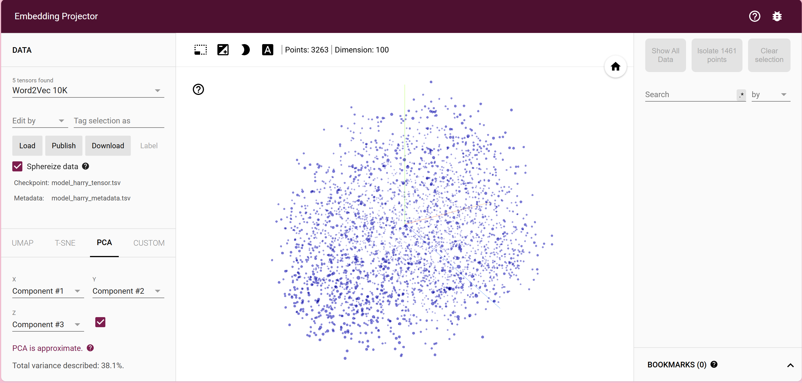
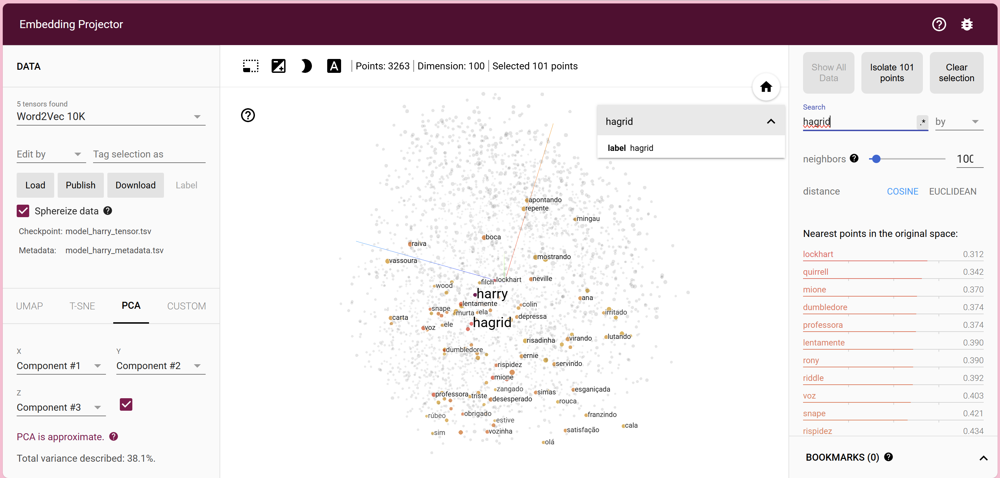
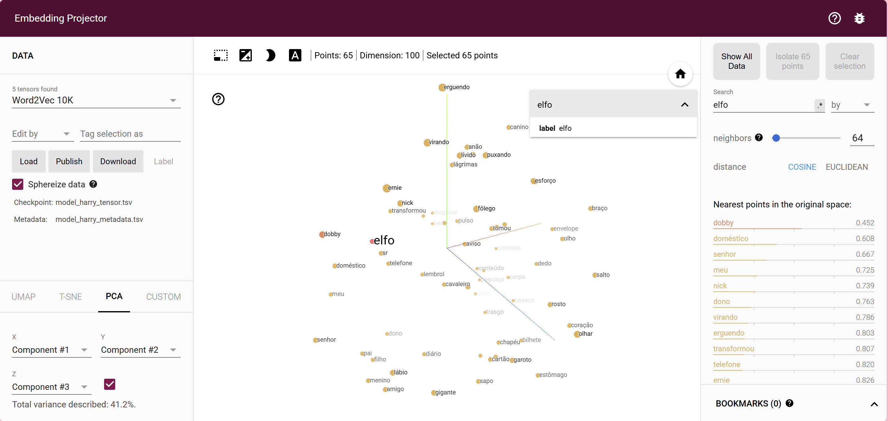

# Word2Vec com Gensim - Harry Potter (Português)

Este projeto demonstra como utilizar a biblioteca **Gensim** para treinar e explorar embeddings de palavras com o modelo **Word2Vec**, aplicando-o a textos reais — neste caso, livros do **Harry Potter** em **português**.

## 📌 Objetivos

- Treinar um modelo Word2Vec com textos reais.
- Explorar relações semânticas entre palavras.
- Visualizar embeddings com o [TensorFlow Projector](https://projector.tensorflow.org).

---

## 📚 Conteúdo

1. **Exemplo básico com frases simples**
2. **Treinamento com livros em português:**
   - *Harry Potter e a Pedra Filosofal*
   - *Harry Potter e a Câmara Secreta*
3. **Exploração dos embeddings:**
   - Palavras similares (`most_similar`)
   - Similaridade entre pares (`similarity`)
   - Palavra fora do contexto (`doesnt_match`)
4. **Exportação para visualização interativa com TensorFlow Projector**

---

## 🚀 Como Usar

### 1. Requisitos

Instale a biblioteca Gensim:

```bash
pip install gensim
```

Garanta que os arquivos de texto estejam na mesma pasta do notebook:
- `Harry_Potter_e_A_Pedra_Filosofal.txt`
- `Harry_Potter_Camara_Secreta-br.txt`

### 2. Execução

Execute o notebook sequencialmente. Para visualizar os vetores no TensorFlow Projector:

```python
model.wv.save_word2vec_format('model_harry.txt', binary=False)
```

```bash
python -m gensim.scripts.word2vec2tensor --input model_harry.txt --output model_harry
```

Acesse [projector.tensorflow.org](https://projector.tensorflow.org) e carregue os arquivos `.tsv` gerados.

---

## 🖼️ Visualizações

### Tela Inicial


### Palavras Mais Próximas de "harry"


### Palavras Mais Próximas de "hagrid"


### Palavra "elfo"


---

## 📈 Configurações do Modelo

- `vector_size=100`
- `epochs=20`

## Conclusões

Este notebook apresenta uma aplicação prática do Word2Vec em textos reais, evidenciando como o modelo é capaz de identificar padrões e relações semânticas a partir do contexto de uso das palavras. A abordagem mostrou-se eficaz para explorar significados e proximidades linguísticas em linguagem natural.
